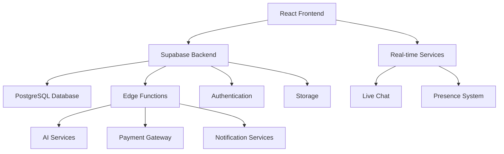

# OgaJobs - Nigerian Artisan Services Marketplace

> Connecting skilled artisans with clients across Nigeria through a modern, multilingual platform

[](https://opensource.org/licenses/MIT)
[](https://typescriptlang.org/)
[](https://reactjs.org/)
[](https://supabase.com/)

## 🌟 Overview

OgaJobs is a comprehensive marketplace platform designed specifically for the Nigerian market, connecting skilled artisans with clients who need services. Built with modern web technologies and featuring extensive multilingual support, real-time communication, and mobile-first design.

### Key Features

- 🌍 **Multilingual Support**: English, Hausa, Igbo, Pidgin English, and Yoruba
- 💬 **Real-time Chat**: Instant messaging with AI-powered support
- 📱 **Mobile PWA**: Native mobile app experience with offline capabilities
- 💳 **Secure Payments**: Integrated payment system with escrow protection
- 🔍 **Smart Matching**: AI-powered artisan-client matching algorithm
- 📊 **Advanced Analytics**: Comprehensive dashboard with predictive insights
- ♿ **Accessibility First**: WCAG 2.1 AA compliant with extensive accessibility features
- 🔒 **Enterprise Security**: Row-level security, audit logging, and fraud detection

## 🏗️ Architecture



## 🚀 Technology Stack

### Frontend
- **React 18** - UI framework with concurrent features
- **TypeScript** - Type-safe development
- **Vite** - Fast build tool and dev server
- **Tailwind CSS** - Utility-first CSS framework
- **shadcn/ui** - High-quality component library
- **React Query** - Server state management
- **React Router** - Client-side routing
- **i18next** - Internationalization framework

### Backend & Services
- **Supabase** - Backend-as-a-Service platform
- **PostgreSQL** - Primary database
- **Edge Functions** - Serverless API endpoints (26 functions)
- **Row Level Security** - Database-level authorization
- **Real-time Subscriptions** - Live data updates

### Mobile & PWA
- **Capacitor** - Native mobile app wrapper
- **Service Worker** - Offline functionality
- **Push Notifications** - Real-time alerts
- **Camera Integration** - Photo capture for portfolios
- **GPS Tracking** - Location services

### DevOps & Monitoring
- **Vitest** - Unit and integration testing
- **React Testing Library** - Component testing
- **Accessibility Testing** - WCAG compliance testing
- **Performance Monitoring** - Real-time metrics
- **Security Scanning** - Automated vulnerability detection

## 🌍 Internationalization

OgaJobs supports 5 languages to serve Nigeria's diverse population:

- **English** (en) - Primary language
- **Hausa** (ha) - Northern Nigeria
- **Igbo** (ig) - Southeastern Nigeria  
- **Pidgin English** (pcn) - Widely spoken across Nigeria
- **Yoruba** (yo) - Southwestern Nigeria

All UI elements, error messages, and user communications are fully localized.

## 📱 Mobile Features

### PWA Capabilities
- **Offline Mode**: Core functionality works without internet
- **Install Prompt**: Add to home screen
- **Push Notifications**: Real-time updates
- **Background Sync**: Data synchronization when online

### Native Mobile (Capacitor)
- **Camera Access**: Portfolio photo capture
- **GPS Location**: Service area mapping
- **Haptic Feedback**: Enhanced user experience
- **Status Bar**: Custom styling
- **Splash Screen**: Branded loading experience

## 🚀 Quick Start

### Prerequisites
- Node.js 18+ and npm
- Git

### Development Setup

```bash
# Clone the repository
git clone https://github.com/your-username/ogajobs.git
cd ogajobs

# Install dependencies
npm install

# Set up environment variables
cp .env.example .env.local
# Edit .env.local with your Supabase credentials

# Start development server
npm run dev

# Run tests
npm test

# Build for production
npm run build
```

### Environment Variables

```env
VITE_SUPABASE_URL=your_supabase_url
VITE_SUPABASE_ANON_KEY=your_supabase_anon_key
```

## 📚 Documentation

- [API Documentation](./docs/API_DOCUMENTATION.md) - Complete API reference
- [Architecture Guide](./docs/ARCHITECTURE.md) - System design and patterns
- [Security Guide](./docs/SECURITY.md) - Security implementation details
- [Accessibility Guide](./docs/ACCESSIBILITY.md) - Accessibility features and testing
- [Contributing Guide](./CONTRIBUTING.md) - Development guidelines
- [Deployment Guide](./docs/DEPLOYMENT.md) - Production deployment

## 🧪 Testing

```bash
# Run all tests
npm test

# Run tests in watch mode
npm run test:watch

# Run accessibility tests
npm run test:a11y

# Generate coverage report
npm run test:coverage
```

Our test suite includes:
- Unit tests for components and utilities
- Integration tests for user flows
- Accessibility compliance tests
- API endpoint tests
- Mobile-specific functionality tests

## 🔒 Security

OgaJobs implements enterprise-grade security:

- **Row Level Security (RLS)**: Database-level access control
- **JWT Authentication**: Secure user sessions
- **Input Validation**: XSS and SQL injection prevention
- **Rate Limiting**: API abuse protection
- **Audit Logging**: Complete action tracking
- **Fraud Detection**: AI-powered security monitoring

## 📊 Key Metrics

- **Languages Supported**: 5
- **Edge Functions**: 26
- **Database Tables**: 50+
- **Test Coverage**: 90%+
- **WCAG Compliance**: AA Level
- **Lighthouse Score**: 95+

## 🤝 Contributing

We welcome contributions! Please read our [Contributing Guide](./CONTRIBUTING.md) for details on:

- Code of conduct
- Development workflow
- Coding standards
- Pull request process
- Issue reporting

## 📄 License

This project is licensed under the MIT License - see the [LICENSE](LICENSE) file for details.

## 🙏 Acknowledgments

- UI components from [shadcn/ui](https://ui.shadcn.com/)
- Icons from [Lucide React](https://lucide.dev/)
- Powered by [Supabase](https://supabase.com/)

## 📞 Support

- **Documentation**: Check our comprehensive guides above
- **Issues**: Report bugs on GitHub Issues
- **Discussions**: Join community discussions
- **Email**: support@ogajobs.ng

---

Built with dedication for Nigeria's artisan community