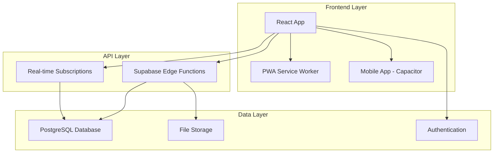

# Architecture Guide

## System Overview

OgaJobs uses a modern, scalable architecture built on React frontend with Supabase backend services.

## Architecture Diagram

## Key Components

### Frontend Architecture
- **React 18**: Modern UI with concurrent features
- **TypeScript**: Type safety throughout
- **Vite**: Fast development and building
- **Tailwind + shadcn/ui**: Design system
- **React Query**: Server state management
- **i18next**: 5-language internationalization

### Backend Services
- **26 Edge Functions**: Serverless API endpoints
- **Row Level Security**: Database-level authorization
- **Real-time**: Live updates via WebSockets
- **File Storage**: Secure document/image handling

### Security Architecture
- JWT authentication with automatic refresh
- Row-level security policies on all tables
- Input validation and sanitization
- Rate limiting and fraud detection
- Comprehensive audit logging

### Mobile Architecture
- PWA with offline capabilities
- Capacitor for native mobile features
- Push notifications via FCM
- Background sync for data updates

## Data Flow

1. User actions trigger React state updates
2. React Query manages server state synchronization
3. Edge functions handle business logic
4. Database operations respect RLS policies
5. Real-time subscriptions update UI automatically

## Performance Optimizations

- Code splitting and lazy loading
- Image optimization and caching
- Database indexing and query optimization
- CDN for static assets
- Service worker caching strategies

## Scalability Considerations

- Serverless edge functions auto-scale
- Database connection pooling
- Horizontal scaling via Supabase infrastructure
- Efficient real-time subscription management